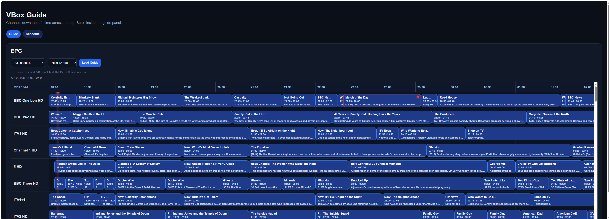
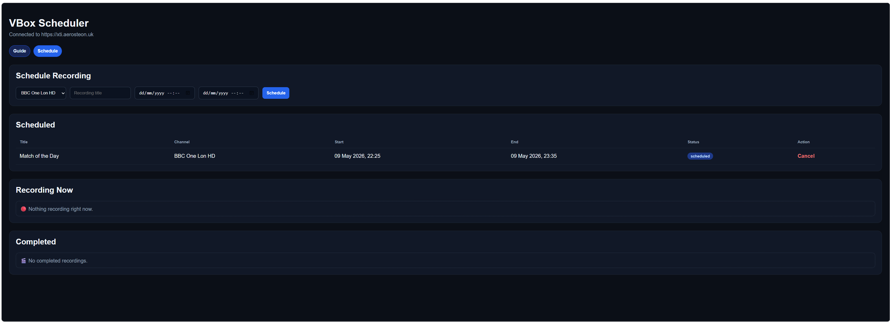

# VBox Scheduler

A modern self-hosted web UI for VBox TV Gateway devices.

VBox Scheduler was originally designed to make manual recording scheduling easier than the standard VBox interface, while also providing a cleaner and more responsive TV guide experience.

The application supports:

- Manual recording scheduling by channel, date and time
- EPG / TV guide browsing
- Recording directly from the guide
- Cancelling scheduled recordings
- Stopping live recordings
- Managing completed recordings

Designed for homelab and self-hosted Docker environments.

---

# Features

## Recording Management

- Manual recording scheduling
- Schedule recordings by channel, start time and end time
- Cancel scheduled recordings
- Stop active recordings
- Delete completed recordings
- Recording status badges

## EPG / Guide

- Modern dark TV guide interface
- Live "Now" line
- Record directly from the guide
- Cancel recordings directly from the guide
- Scheduled programme highlighting
- Sticky channel column
- Sticky timeline header
- Multi-hour guide windows
- Channel filtering
- Scroll position preservation

## Technical

- FastAPI backend
- Docker deployment
- VBox XMLTV integration
- Built-in caching
- Responsive interface
- Lightweight design


---

# Requirements

- VBox TV Gateway device
- Docker
- Network access to the VBox device

---

# Quick Start

## Clone repository

```bash
git clone https://github.com/aerosteon/vbox-scheduler.git
cd vbox-scheduler
```

## Create environment file

```bash
cp .env.example .env
```

Edit:

```env
VBOX_BASE_URL=http://your-vbox-ip-or-dns
```

## Start container

```bash
docker compose up -d
```

Then open:

```text
http://your-server-ip:8000
```

---

# Screenshots

## EPG Guide



## Schedule Page



